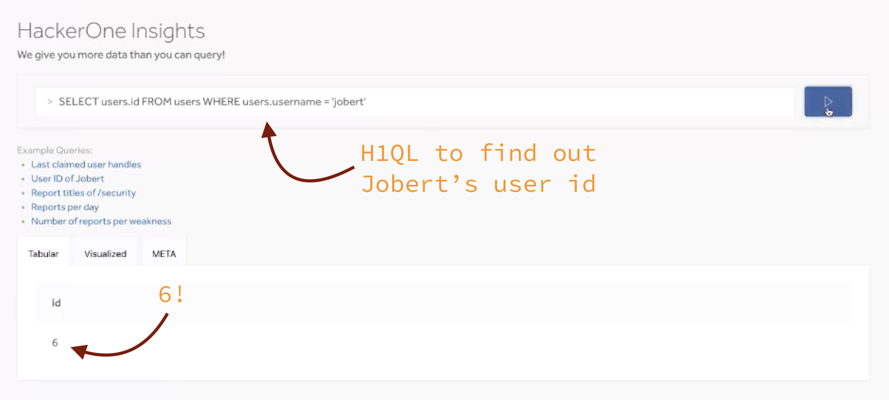

For a hack day, we wanted to see how feasible it is to accept any SQL from the client to quickly build features that show data and render graphs. The challenge is that we want to accept "any" querym don't want to expose our private data, and that we don't have authorization logic in our database layer.

# Meet H1QL
H1QL (HackerOne Query Language) is a subset of SQL; it only supports operations that can be executed safely. For example, only non-mutative operations are supported and it doesn't allow execution of operations that require direct file access. 

Rather than relying on authorization logic living in the database, H1QL will transform the query that will be sent to the database and includes the authorization rules. The authorization constraints can be applied to row, column, and even column*row level (although this will give you some interesting "what is `NULL`" problems).

For example, if we would query teams and the system only exposes visible teams, H1QL would transform the requested query:
```sql
SELECT teams.id FROM teams;
```
Into a query that includes the authorization rules:
```sql
SELECT teams.id FROM (SELECT * FROM teams WHERE visible = true) teams;
```

As access to every row and every column is guarded, we can safely accept any SQL request no matter the source. Next to "boring" reads, this allows users to do advanced computational operations on the data they can access. For example, a user can: count, avg, max, generate time series, or any other (safe) SQL operation. 

## Our (PoC) implementation:
```
     +                H1QL Engine                                                       +
User |               +---------------------------------------------------+     Database |
     |               |                                                   |              |
     |               |  tokenization  transform   transform   to sql     |              |
     |  H1QL Query   |   & parsing    sql->h1ql  unsafe->safe            |  SQL Query   |
     | +-----------> |       +            +           +          +       | +----------> |
     |               |       |            |           |          |       |              |
     |               | +---> | +---+----> | +---+---> | +---+--+ | +-+-> |              |
     |               |       |     |      |     |     |     |    |   |   |              |
     |               |       +     |      +     |     +     |    +   |   |              |
     |               |      (1)    +     (2)    +    (3)    +   (4)  +   |              |
     |               |          SQL AST      (unsafe)     (safe)    SQL  |              |
     |               |                         AREL        AREL          |              |
     |               |                                                   |              |
     |               +---------------------------------------------------+              |
     |                                                                                  |
     |                                                                        Response  |
     | <------------------------------------------------------------------------------+ |
     |                                                                                  |
     +                                                                                  +
```

*(1) tokenization & parsing*

As H1QL is SQL, our setup uses [pg_query](https://github.com/lfittl/pg_query) to parse an incoming H1QL request. It returns a Ruby representation of the PostgreSQL AST and we're using [to_arel](https://github.com/mvgijssel/to_arel) to transform this AST into [Arel](https://github.com/rails/rails/tree/master/activerecord/lib/arel). We use ARel as intermediate storage between processes.

*(2) transform SQL to H1QL*

Using a [visitor pattern]([https://en.wikipedia.org/wiki/Visitor_pattern), we're creating a new AST that only contains nodes (column, table, functions, etc) that are allowed in H1QL. If the visitor stumbles upon an unsafe or unknown node, it will stop execution by raising an exception that will be shown to the requester.

*(3) transform unsafe->safe*

This processor will transform the insecure Arel AST to an Arel AST that includes the authorization contraints and is safe to executed. Using a visitor, we again visit every node in the Arel AST and verify what the access rules apply to this object. If we visit a node that has restricted accessibility, we'll replace it with a conditional node that includes these access rules. 

*(4) to_sql*

The last process is to transform the AST to SQL. As we use Arel as intermediate storage, this process is just a simple call to `to_sql`.


# Installation

Unfortunately, you can't. We ([@mvggijssel](https://github.com/mvgijssel) and [@willianvdv](https://github.com/Willianvdv)) build as part of a HackerOne hack day and is currently more an idea with a PoC than a library that can be used in production. To prove you we actually did more than writing this readme, here are some screenshots of the demo we gave to the HackerOne team.


*You want to know what Jobert's id is on my local machine? It's 6, a pretty high number for a co-founder if you ask me ;)*


*Rendering fancy Graphs using the visualized mode!*


*We're using our existing authorization DSL to create the safe queries. The queries we execute are HUGE and could use some optimization.*

# Using H1QL Engine in Rails
Any query executed within an H1QL block will be automatically secured. Engineers have less worries about introducing IDORs as all calls to the database are automatically secured.
```ruby
class SecretController < ApplicationController
  around_action :h1ql
  
  def index
    return Secret.all # 1
  end
  
  private
  
  def h1ql
    H1QL.new(requester: User.first) do
      yield
    end
  end
end
```

# Inspiration
- [NewRelic's NRQL](https://docs.newrelic.com/docs/insights/nrql-new-relic-query-language/nrql-reference/nrql-syntax-components-functions)
- [ElasticSearch SQL](https://www.elastic.co/products/stack/elasticsearch-sql)

# Open Questions
- What about performance? If you have a query with a lots of joins and attribute references, will it significantly impact the performance?
- How can we proof H1QL is actually safe? And how can we keep it safe?
